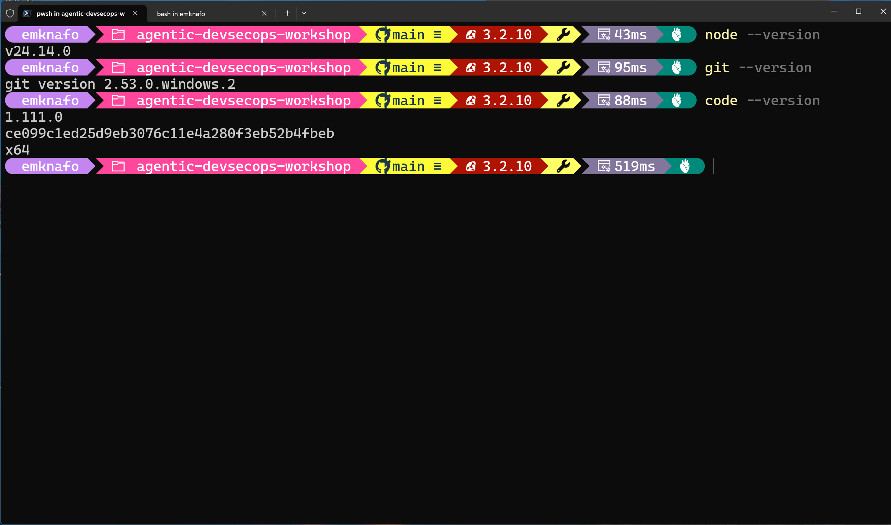
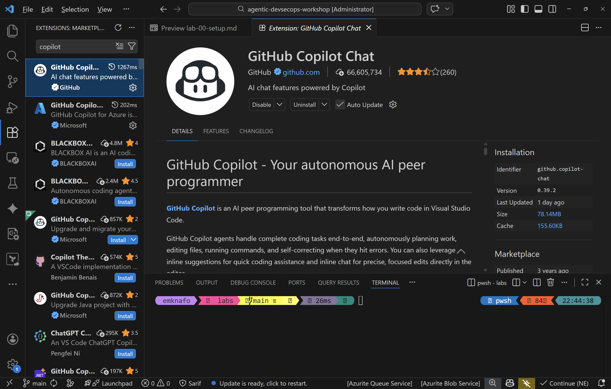

## Aperçu

| | |
|---|---|
| **Durée** | 30 minutes |
| **Niveau** | Débutant |
| **Prérequis** | Aucun |

## Objectifs d'apprentissage

À la fin de ce lab, vous serez en mesure de :

* Installer les outils requis (Node.js v20+, Git, VS Code)
* Installer les quatre extensions VS Code utilisées tout au long de l'atelier
* Créer votre propre dépôt à partir du modèle de l'atelier
* Vérifier que GitHub Copilot Chat fonctionne et peut voir les agents de l'espace de travail

## Exercices

### Exercice 0.1 : Installer les outils requis

Vous avez besoin de trois outils sur votre machine avant de commencer l'atelier. Si vous les avez déjà installés, confirmez les versions minimales ci-dessous.

1. **Node.js v20 ou ultérieur** — téléchargez depuis <https://nodejs.org> si vous ne l'avez pas.

   Ouvrez un terminal et exécutez :

   ```bash
   node --version
   ```

   Confirmez que la sortie affiche `v20.x.x` ou une version supérieure.

2. **Git** — téléchargez depuis <https://git-scm.com> si vous ne l'avez pas.

   ```bash
   git --version
   ```

3. **Visual Studio Code** — téléchargez depuis <https://code.visualstudio.com> si vous ne l'avez pas.

   ```bash
   code --version
   ```



### Exercice 0.2 : Installer les extensions VS Code

Ouvrez VS Code et installez les quatre extensions suivantes depuis le panneau Extensions (`Ctrl+Shift+X`) :

| Extension | ID |
|---|---|
| GitHub Copilot | `github.copilot` |
| GitHub Copilot Chat | `github.copilot-chat` |
| SARIF Viewer | `MS-SarifVSCode.sarif-viewer` |
| ESLint | `dbaeumer.vscode-eslint` |

Vous pouvez également les installer depuis le terminal :

```bash
code --install-extension github.copilot
code --install-extension github.copilot-chat
code --install-extension MS-SarifVSCode.sarif-viewer
code --install-extension dbaeumer.vscode-eslint
```

Après l'installation, confirmez que les quatre extensions apparaissent comme activées dans le panneau Extensions.



### Exercice 0.3 : Créer votre dépôt d'atelier

1. Accédez à <https://github.com/devopsabcs-engineering/agentic-accelerator-workshop> dans votre navigateur.
2. Cliquez sur **Use this template** puis sélectionnez **Create a new repository**.
3. Définissez le nom du dépôt comme `agentic-accelerator-workshop` sous votre compte GitHub personnel.
4. Définissez la visibilité sur **Public** (requis pour les fonctionnalités de l'onglet GitHub Security dans les labs suivants).
5. Cliquez sur **Create repository**.
6. Clonez le dépôt sur votre machine locale :

   ```bash
   git clone https://github.com/<your-username>/agentic-accelerator-workshop.git
   ```

7. Ouvrez le dépôt dans VS Code :

   ```bash
   code agentic-accelerator-workshop
   ```

### Exercice 0.4 : Vérifier Copilot Chat

1. Ouvrez le panneau Copilot Chat (`Ctrl+Shift+I` sous Windows ou `Cmd+Shift+I` sous macOS).
2. Tapez le message suivant :

   ```text
   Hello, can you see the agents in this workspace?
   ```

3. Copilot devrait répondre avec une liste des agents qu'il peut voir (par exemple, `@security-agent`, `@a11y-detector`).
4. Si Copilot ne liste aucun agent, confirmez que le dossier `.github/agents/` est présent dans votre espace de travail et que les extensions Copilot sont activées.


## Point de vérification

Avant de continuer, vérifiez :

* [ ] `node --version` retourne v20.x.x ou une version supérieure
* [ ] Les quatre extensions VS Code sont installées et activées
* [ ] Votre dépôt d'atelier est créé à partir du modèle et cloné localement
* [ ] Copilot Chat répond et liste les agents de l'espace de travail

## Étapes suivantes

Passez au [Lab 01 — Explorer l'application exemple](lab-01.md).
