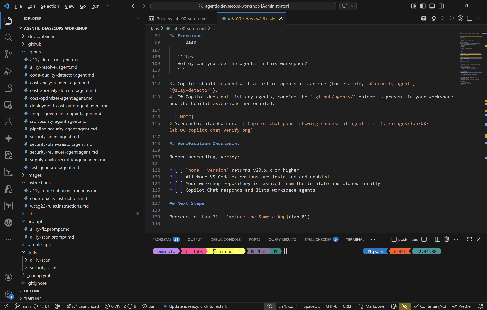
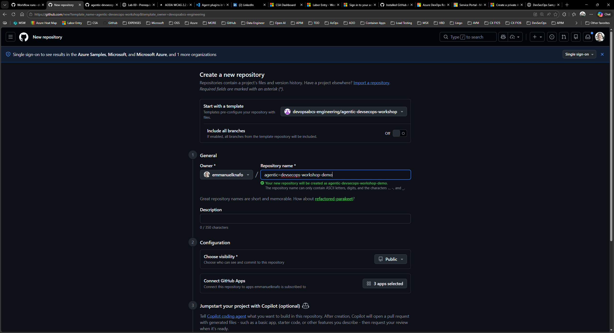

## Aperçu

| | |
|---|---|
| **Durée** | 25 minutes |
| **Niveau** | Débutant |
| **Prérequis** | [Lab 00](lab-00-setup.md) |

## Objectifs d'apprentissage

À la fin de ce lab, vous serez en mesure de :

* Naviguer dans la structure du dépôt de l'atelier et identifier les répertoires clés
* Identifier les quatre domaines d'agents : Sécurité, Accessibilité, Qualité du code et FinOps
* Exécuter l'application exemple Next.js localement
* Découvrir les vulnérabilités intentionnelles intégrées dans l'application exemple

## Exercices

### Exercice 1.1 : Explorer la structure du dépôt

Ouvrez l'explorateur VS Code (`Ctrl+Shift+E`) et examinez l'arborescence des répertoires de premier niveau :

| Répertoire | Objectif |
|---|---|
| `.github/agents/` | Définitions d'agents Copilot personnalisés (un fichier `.agent.md` par agent) |
| `.github/instructions/` | Règles permanentes que Copilot applique automatiquement en fonction des globs `applyTo` |
| `.github/prompts/` | Modèles de prompts réutilisables invoqués à la demande |
| `.github/skills/` | Paquets de connaissances de domaine chargés par les agents lorsqu'ils ont besoin d'un contexte approfondi |
| `sample-app/` | Une application Next.js avec des problèmes intentionnels de sécurité, d'accessibilité et de FinOps |

Prenez un moment pour développer chaque répertoire et noter le nombre de fichiers qu'il contient.



### Exercice 1.2 : Examiner les problèmes intentionnels

L'application exemple inclut des vulnérabilités délibérées que les agents détecteront dans les labs suivants. Ouvrez chaque fichier ci-dessous, trouvez les commentaires `INTENTIONAL-VULNERABILITY` et notez ce que vous observez.

1. **`sample-app/src/lib/auth.ts`** — Cryptographie faible et jetons prévisibles.
   * `Math.random()` utilisé pour la génération de jetons de session (ligne 38–39)
   * `md5` utilisé pour le hachage des mots de passe (ligne 12)
   * Secret JWT et clé API codés en dur (lignes 4–7)

2. **`sample-app/src/lib/db.ts`** — Injection SQL via concaténation de chaînes.
   * `getProductById()` construit le SQL avec interpolation de chaînes (ligne 33)
   * `searchProducts()` fait de même (ligne 39)
   * Chaîne de connexion à la base de données codée en dur avec identifiants en clair (ligne 4)

3. **`sample-app/src/components/ProductCard.tsx`** — Cross-site scripting (XSS).
   * `dangerouslySetInnerHTML` affiche des descriptions fournies par l'utilisateur sans assainissement (ligne 24)

4. **`sample-app/infra/main.bicep`** — SKU surdimensionnés et mauvaises configurations de sécurité.
   * Plan App Service Premium V3 pour une application exemple (ligne 28)
   * Réplication de stockage GRS là où LRS suffirait (ligne 68)
   * Trafic HTTP autorisé, TLS 1.0 permis (lignes 51–53)
   * Mot de passe administrateur SQL en clair comme paramètre (ligne 16)


### Exercice 1.3 : Exécuter l'application exemple

1. Ouvrez un terminal dans VS Code (`Ctrl+`` `) et naviguez vers l'application exemple :

   ```bash
   cd sample-app
   ```

2. Installez les dépendances :

   ```bash
   npm install
   ```

3. Démarrez le serveur de développement :

   ```bash
   npm run dev
   ```

4. Ouvrez <http://localhost:3000> dans votre navigateur.
5. Parcourez la page des produits et cliquez sur un produit pour afficher sa page de détails.
6. Lorsque vous avez terminé l'exploration, arrêtez le serveur de développement avec `Ctrl+C`.


### Exercice 1.4 : Noter le flux de création à partir du modèle

Lorsque d'autres participants rejoignent l'atelier, ils créent leur propre dépôt à partir de ce modèle en utilisant le bouton GitHub **Use this template**. C'est la même étape que vous avez réalisée dans le Lab 00, Exercice 0.3.

Notez comment le modèle préserve l'intégralité de la structure des répertoires, les définitions d'agents et l'application exemple afin que chaque étudiant parte de la même base.



## Point de vérification

Avant de continuer, vérifiez :

* [ ] Vous pouvez identifier les cinq répertoires clés (`.github/agents/`, `.github/instructions/`, `.github/prompts/`, `.github/skills/`, `sample-app/`)
* [ ] Vous avez trouvé au moins trois vulnérabilités intentionnelles par nom de fichier
* [ ] L'application exemple s'exécute localement à <http://localhost:3000>
* [ ] Vous comprenez que les quatre domaines d'agents sont Sécurité, Accessibilité, Qualité du code et FinOps

## Étapes suivantes

Passez au [Lab 02 — Comprendre les agents, les skills et les instructions](lab-02.md).
