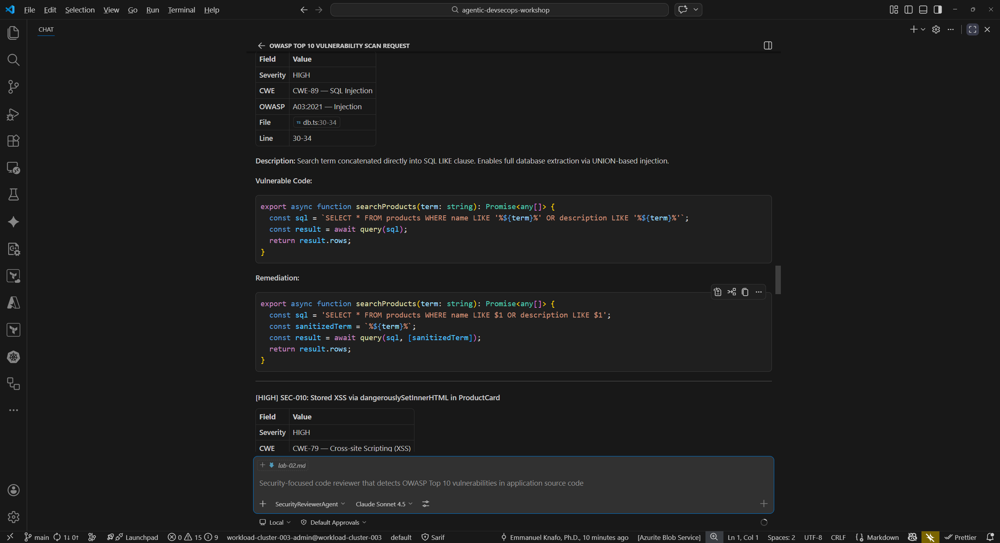
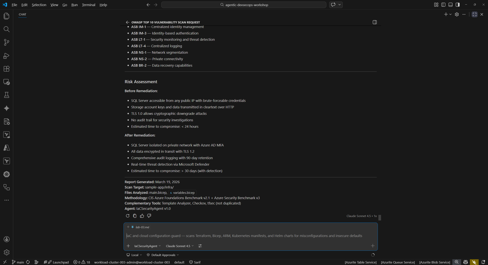

## Aperçu

| | |
|---|---|
| **Durée** | 40 minutes |
| **Niveau** | Intermédiaire |
| **Prérequis** | [Lab 00](lab-00-setup.md), [Lab 01](lab-01.md), [Lab 02](lab-02.md) |

## Objectifs d'apprentissage

À la fin de ce lab, vous serez capable de :

* Exécuter le security-reviewer-agent pour détecter les vulnérabilités OWASP Top 10 dans le code source
* Exécuter le iac-security-agent pour détecter les erreurs de configuration d'infrastructure dans les modèles Bicep
* Exécuter le supply-chain-security-agent pour détecter les risques liés aux dépendances dans les manifestes de paquets
* Interpréter les résultats de sécurité avec les identifiants CWE et les niveaux de sévérité

## Exercices

### Exercice 3.1 : Analyse de sécurité du code source

Dans cet exercice, vous utilisez le Security Reviewer Agent pour analyser le code source de l'application exemple à la recherche de vulnérabilités courantes.

1. Ouvrez le panneau Copilot Chat (`Ctrl+Shift+I`).
2. Tapez l'invite suivante :

   ```text
   @security-reviewer-agent Scan sample-app/src/ for OWASP Top 10 vulnerabilities. Report findings with CWE IDs and severity.
   ```

3. Attendez que l'agent termine son analyse. Examinez la sortie et recherchez les catégories de résultats suivantes :

   | Résultat | CWE | Fichier |
   |---|---|---|
   | Injection SQL via concaténation de chaînes | CWE-89 | `sample-app/src/lib/db.ts` |
   | Cross-site scripting (XSS) via `dangerouslySetInnerHTML` | CWE-79 | `sample-app/src/components/ProductCard.tsx` |
   | Secrets codés en dur (secret JWT, clé API) | CWE-798 | `sample-app/src/lib/auth.ts` |
   | Hachage cryptographique faible (MD5) | CWE-328 | `sample-app/src/lib/auth.ts` |
   | Génération de jetons prévisible (`Math.random()`) | CWE-330 | `sample-app/src/lib/auth.ts` |

4. Notez le niveau de sévérité attribué à chaque résultat. Les résultats Critiques et Élevés représentent des risques immédiats qui doivent être traités avant le déploiement.



### Exercice 3.2 : Analyse de sécurité de l'infrastructure

Ensuite, analysez le modèle d'infrastructure en tant que code à la recherche d'erreurs de configuration de sécurité.

1. Dans Copilot Chat, tapez :

   ```text
   @iac-security-agent Scan sample-app/infra/main.bicep for security misconfigurations
   ```

2. Examinez les résultats. L'agent devrait identifier des problèmes tels que :

   * Accès public aux blobs activé sur le compte de stockage
   * TLS 1.0 autorisé (la version TLS minimale devrait être 1.2)
   * Trafic HTTP autorisé (HTTPS devrait être imposé)
   * Règles de pare-feu trop permissives
   * Mot de passe administrateur SQL transmis en clair en tant que paramètre

3. Pour chaque résultat, notez le numéro de ligne dans `main.bicep` et la remédiation recommandée.



### Exercice 3.3 : Sécurité de la chaîne d'approvisionnement

Analysez maintenant les dépendances du projet à la recherche de vulnérabilités connues et de risques liés aux licences.

1. Dans Copilot Chat, tapez :

   ```text
   @supply-chain-security-agent Analyze sample-app/package.json for dependency vulnerabilities and license risks
   ```

2. Examinez les résultats. Les problèmes courants incluent :

   * Dépendances avec des CVE connues
   * Vérifications d'intégrité du fichier de verrouillage manquantes
   * Paquets obsolètes avec des correctifs de sécurité disponibles
   * Préoccupations de compatibilité des licences

3. Notez quelles dépendances l'agent signale et les chemins de mise à jour recommandés.


### Exercice 3.4 : Comparer les résultats avec les problèmes connus

Dans le Lab 01, vous avez manuellement examiné l'application exemple et identifié des vulnérabilités intentionnelles. Comparez maintenant ces résultats manuels avec les résultats de l'agent.

1. Ouvrez vos notes du Lab 01 (ou revisitez `sample-app/src/` et `sample-app/infra/` pour vous rafraîchir la mémoire).
2. Créez un tableau comparatif :

   | Problème | Trouvé manuellement (Lab 01) | Trouvé par l'agent (Lab 03) |
   |---|---|---|
   | Injection SQL dans `db.ts` | Oui / Non | Oui / Non |
   | XSS dans `ProductCard.tsx` | Oui / Non | Oui / Non |
   | Secrets codés en dur dans `auth.ts` | Oui / Non | Oui / Non |
   | Cryptographie faible dans `auth.ts` | Oui / Non | Oui / Non |
   | Erreur de configuration TLS dans `main.bicep` | Oui / Non | Oui / Non |

3. Réfléchissez à ces questions :

   * Quels problèmes les agents ont-ils trouvés que vous avez manqués lors de la revue manuelle ?
   * Avez-vous repéré quelque chose dans le Lab 01 que les agents n'ont pas signalé ?
   * Comment l'analyse automatisée par agents complète-t-elle la revue de code manuelle ?


## Point de vérification

Avant de continuer, vérifiez que :

* [ ] Le security-reviewer-agent a trouvé des vulnérabilités dans le code source avec des identifiants CWE
* [ ] Le iac-security-agent a trouvé des erreurs de configuration dans le modèle Bicep
* [ ] Le supply-chain-security-agent a analysé les dépendances à la recherche de risques
* [ ] Vous avez identifié au moins 5 vulnérabilités au total avec des identifiants CWE sur l'ensemble des analyses
* [ ] Vous avez comparé les résultats des agents avec votre revue manuelle du Lab 01

## Étapes suivantes

Passez au [Lab 04 — Analyse d'accessibilité avec les agents Copilot](lab-04.md).
