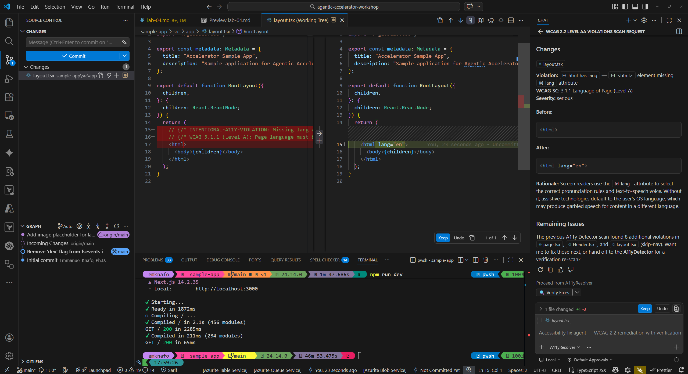
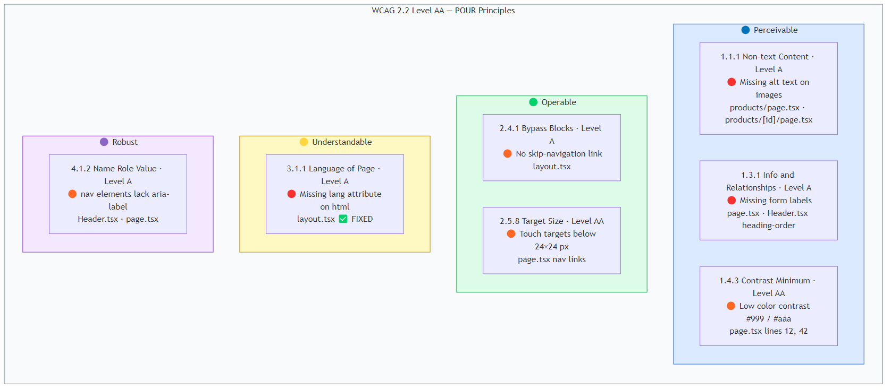

## Aperçu

| | |
|---|---|
| **Durée** | 35 minutes |
| **Niveau** | Intermédiaire |
| **Prérequis** | [Lab 00](lab-00-setup.md), [Lab 01](lab-01.md), [Lab 02](lab-02.md) |

## Objectifs d'apprentissage

À la fin de ce lab, vous serez capable de :

* Exécuter le a11y-detector pour détecter les violations WCAG 2.2 Level AA
* Utiliser le modèle d'invite a11y-scan pour une analyse ciblée de composants
* Essayer le transfert vers le a11y-resolver pour des corrections d'accessibilité automatisées
* Associer les résultats aux critères de succès WCAG correspondants

## Exercices

### Exercice 4.1 : Analyse d'accessibilité complète

Commencez par une analyse globale de l'ensemble du répertoire source de l'application exemple.

1. Ouvrez le panneau Copilot Chat (`Ctrl+Shift+I`).
2. Tapez l'invite suivante :

   ```text
   @a11y-detector Scan sample-app/src/ for WCAG 2.2 Level AA violations
   ```

3. Attendez que le détecteur termine son analyse. Examinez la sortie et recherchez des résultats tels que :

   | Résultat | Critère WCAG | Fichier |
   |---|---|---|
   | Attribut `lang` manquant sur l'élément `<html>` | 3.1.1 Langue de la page | `sample-app/src/app/layout.tsx` |
   | Ratios de contraste de couleur insuffisants | 1.4.3 Contraste (minimum) | `sample-app/src/app/globals.css` |
   | Libellés de formulaire ou attributs `aria-label` manquants | 1.3.1 Information et relations | `sample-app/src/app/products/page.tsx` |
   | Cibles tactiles inférieures à 44x44 pixels CSS | 2.5.8 Taille de la cible (minimum) | Plusieurs composants |

4. Comptez le nombre total de violations signalées. Le détecteur devrait trouver au moins 5 problèmes distincts.


### Exercice 4.2 : Analyse ciblée d'un composant avec le fichier d'invite

Au lieu d'analyser l'ensemble du répertoire, utilisez le fichier d'invite a11y-scan pour vous concentrer sur un seul composant.

1. Dans Copilot Chat, tapez :

   ```text
   /a11y-scan component=sample-app/src/app/page.tsx
   ```

2. Comparez la sortie ciblée avec l'analyse complète de l'exercice 4.1. Remarquez que l'analyse ciblée se concentre sur un seul composant et fournit des résultats plus détaillés pour ce fichier.
3. L'approche par fichier d'invite est utile lorsque vous souhaitez vérifier un composant spécifique pendant le développement plutôt que d'analyser l'ensemble du projet.


### Exercice 4.3 : Transfert vers le résolveur

Essayez maintenant le modèle de transfert détecteur-vers-résolveur que vous avez appris dans le Lab 02.

1. À partir de la sortie du détecteur de l'exercice 4.1, identifiez le résultat concernant l'attribut `lang` manquant.
2. Dans Copilot Chat, tapez :

   ```text
   @a11y-resolver Fix the missing lang attribute in sample-app/src/app/layout.tsx
   ```

3. Examinez la correction proposée. Le résolveur devrait suggérer l'ajout de `lang="en"` à l'élément `<html>` dans `layout.tsx`.
4. Examinez la modification de code que le résolveur propose. Vérifiez qu'elle corrige la violation WCAG 3.1.1 sans introduire de nouveaux problèmes.
5. Optionnellement, acceptez la correction et relancez le détecteur pour confirmer que la violation est résolue.



### Exercice 4.4 : Associer les résultats aux critères WCAG

Passez en revue tous les résultats des exercices précédents et associez chacun à son critère de succès WCAG 2.2.

1. Créez un tableau de référence pour vos résultats :

   | Résultat | Critère WCAG | Niveau | Principe |
   |---|---|---|---|
   | Attribut `lang` manquant | 3.1.1 Langue de la page | A | Compréhensible |
   | Faible contraste de couleur | 1.4.3 Contraste (minimum) | AA | Perceptible |
   | Libellés de formulaire manquants | 1.3.1 Information et relations | A | Perceptible |
   | Cibles tactiles trop petites | 2.5.8 Taille de la cible (minimum) | AA | Utilisable |
   | Texte alternatif manquant sur les images | 1.1.1 Contenu non textuel | A | Perceptible |

2. Réfléchissez à l'importance de l'accessibilité au-delà de la conformité :

   * Les utilisateurs ayant des déficiences visuelles s'appuient sur des lecteurs d'écran qui nécessitent un balisage sémantique approprié.
   * Les utilisateurs ayant des déficiences motrices ont besoin de cibles tactiles de taille adéquate.
   * Les utilisateurs ayant des troubles cognitifs bénéficient d'un contenu clair et bien structuré.
   * Les applications accessibles sont souvent plus faciles à utiliser pour tout le monde.

3. Notez les niveaux de conformité WCAG (A, AA, AAA). Le niveau AA est la norme que la plupart des organisations visent pour la conformité.



## Point de vérification

Avant de continuer, vérifiez que :

* [ ] Le a11y-detector a trouvé au moins 5 violations WCAG 2.2 Level AA
* [ ] Vous avez utilisé le fichier d'invite `/a11y-scan` pour une analyse ciblée de composant
* [ ] Le a11y-resolver a proposé au moins 2 corrections pour les violations détectées
* [ ] Vous pouvez associer chaque résultat à un critère de succès WCAG spécifique
* [ ] Vous comprenez le cycle détecter → corriger → vérifier du Lab 02

## Étapes suivantes

Passez au [Lab 05 — Analyse de la qualité du code avec les agents Copilot](lab-05.md).
