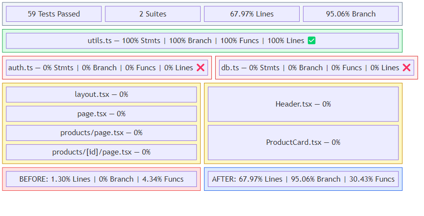

## Aperçu

| | |
|---|---|
| **Durée** | 35 minutes |
| **Niveau** | Intermédiaire |
| **Prérequis** | [Lab 00](lab-00-setup.md), [Lab 01](lab-01.md), [Lab 02](lab-02.md) |

## Objectifs d'apprentissage

À la fin de ce lab, vous serez en mesure de :

* Exécuter la couverture de tests et comprendre l'écart de couverture dans l'application exemple
* Exécuter le code-quality-detector pour détecter les problèmes de qualité, notamment la couverture, la complexité et la maintenabilité
* Utiliser le test-generator pour créer des tests unitaires pour le code non couvert
* Observer l'amélioration de la couverture après l'application des tests générés

## Exercices

### Exercice 5.1 : Mesurer la couverture actuelle

Avant d'exécuter un agent, établissez une référence en mesurant la couverture de tests actuelle.

1. Ouvrez un terminal dans VS Code (`Ctrl+`` `) et naviguez vers l'application exemple :

   ```bash
   cd sample-app
   ```

2. Exécutez la suite de tests avec le rapport de couverture :

   ```bash
   npm test -- --coverage
   ```

3. Examinez la sortie de couverture. Vous devriez voir une couverture d'environ 5 % car seul un test de substitution existe dans `__tests__/placeholder.test.ts`.
4. Notez les fichiers et fonctions spécifiques avec 0 % de couverture. Ce sont les cibles des exercices suivants.


### Exercice 5.2 : Détection de la qualité du code

Utilisez l'agent Code Quality Detector pour obtenir une analyse complète de la qualité.

1. Ouvrez le panneau Copilot Chat (`Ctrl+Shift+I`).
2. Saisissez le prompt suivant :

   ```text
   @code-quality-detector Analyze sample-app/ for code quality issues including coverage, complexity, and maintainability
   ```

3. Examinez les résultats. Le détecteur devrait identifier des problèmes tels que :

   | Résultat | Catégorie | Fichier |
   |---|---|---|
   | Couverture de tests inférieure au seuil de 80 % | Couverture | Ensemble du projet |
   | Complexité cyclomatique élevée | Complexité | `sample-app/src/lib/utils.ts` |
   | Utilisation d'annotations de type `any` | Sécurité des types | Fichiers multiples |
   | Duplication de code dans les fonctions utilitaires | Maintenabilité | `sample-app/src/lib/` |
   | Gestion des erreurs manquante | Fiabilité | `sample-app/src/lib/db.ts` |

4. Notez quels résultats le détecteur signale comme priorité la plus élevée. La faible couverture et les problèmes de sécurité des types sont des points de départ courants pour l'amélioration.


### Exercice 5.3 : Générer des tests

Utilisez l'agent Test Generator pour créer des tests unitaires pour l'un des fichiers non couverts.

1. Dans Copilot Chat, saisissez :

   ```text
   @test-generator Generate unit tests for sample-app/src/lib/utils.ts to improve coverage
   ```

2. Examinez le fichier de test généré. L'agent devrait produire des tests couvrant :

   * Chaque fonction exportée dans `utils.ts`
   * Les cas limites (entrées nulles, chaînes vides, valeurs aux limites)
   * Les valeurs de retour attendues pour les entrées courantes

3. Examinez la structure des tests. Les tests générés doivent utiliser la syntaxe Jest (`describe`, `it`, `expect`) conformément à la configuration du projet dans `jest.config.ts`.


### Exercice 5.4 : Appliquer les tests et remesurer (Optionnel)

Appliquez les tests générés et mesurez l'amélioration de la couverture.

1. Copiez le code de test généré dans un nouveau fichier :

   ```bash
   # Create the test file (paste the generated content)
   code sample-app/__tests__/utils.test.ts
   ```

2. Enregistrez le fichier avec le contenu de test généré de l'exercice 5.3.
3. Relancez la suite de tests avec la couverture :

   ```bash
   cd sample-app
   npm test -- --coverage
   ```

4. Comparez le nouveau pourcentage de couverture avec la référence de l'exercice 5.1. Vous devriez constater une amélioration mesurable de la couverture pour `src/lib/utils.ts`.
5. Cet exercice démontre le cycle détecter → générer → vérifier du Lab 02 : le Code Quality Detector a identifié l'écart, le Test Generator a produit les tests, et la relance de la couverture confirme l'amélioration.



## Point de vérification

Avant de continuer, vérifiez que :

* [ ] Vous avez mesuré la couverture de tests de référence (environ 5 %)
* [ ] Le code-quality-detector a identifié des problèmes de faible couverture, de complexité ou de sécurité des types
* [ ] Le test-generator a produit des tests unitaires pour `utils.ts`
* [ ] (Optionnel) Vous avez appliqué les tests générés et observé une amélioration de la couverture
* [ ] Vous comprenez le cycle détecter → générer → vérifier pour la qualité du code

## Étapes suivantes

Passez au [Lab 06](lab-06.md).
