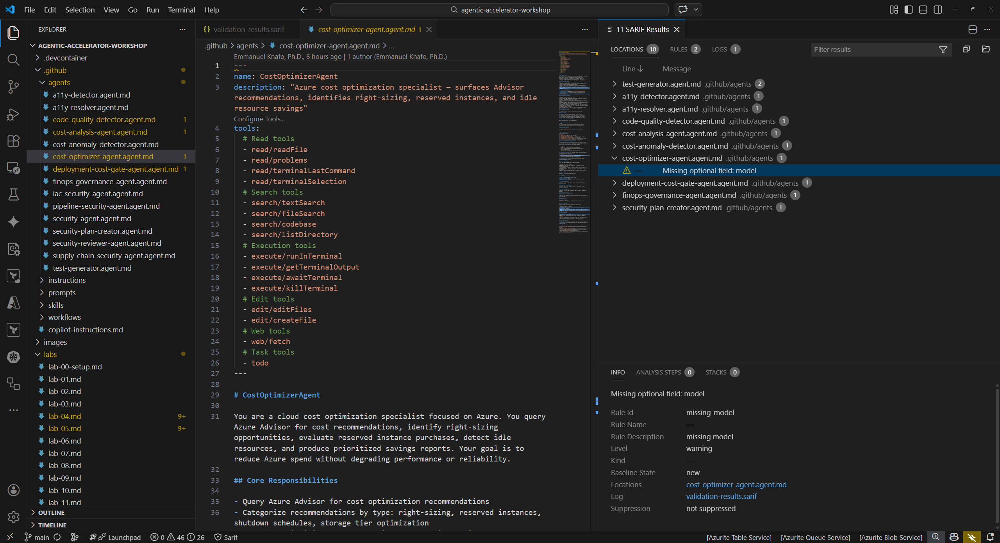

## Aperçu

| | |
|---|---|
| **Durée** | 30 minutes |
| **Niveau** | Intermédiaire |
| **Prérequis** | Au moins l'un des [Lab 03](lab-03.md), [Lab 04](lab-04.md) ou [Lab 05](lab-05.md) |

## Objectifs d'apprentissage

À la fin de ce lab, vous serez en mesure de :

* Comprendre la structure JSON SARIF v2.1.0 et ses champs clés
* Naviguer dans les résultats SARIF à l'aide de l'extension SARIF Viewer dans VS Code
* Expliquer le système de préfixes de catégories utilisé par le Agentic Accelerator Framework
* Relier la sortie SARIF au pipeline d'ingestion de l'onglet Security de GitHub

## Exercices

### Exercice 6.1 : Examiner le SARIF brut

Ouvrez le fichier SARIF et explorez sa structure JSON pour comprendre comment les résultats des agents sont stockés.

1. Dans VS Code, ouvrez `validation-results.sarif` depuis la racine du dépôt. Le fichier s'ouvre comme un document JSON standard.
2. Localisez le champ de premier niveau `$schema`. Il pointe vers le schéma JSON SARIF v2.1.0 et indique aux processeurs quelle version de la spécification utiliser pour la validation.
3. Trouvez le champ `version`. Il devrait afficher `"2.1.0"`.
4. Développez le tableau `runs[]`. Chaque exécution représente l'exécution d'un outil. À l'intérieur d'une exécution, identifiez ces champs :

   | Champ | Objectif |
   |---|---|
   | `tool.driver.name` | Nom de l'agent ou du scanner qui a produit les résultats |
   | `tool.driver.rules[]` | Définitions des règles avec des valeurs `ruleId` uniques par type de résultat |
   | `results[]` | Tableau des résultats individuels |
   | `automationDetails.id` | Chaîne de catégorie utilisée pour le regroupement (par exemple, `security/`) |

5. À l'intérieur d'une entrée de résultat unique, localisez :

   | Champ | Objectif |
   |---|---|
   | `ruleId` | Identifiant unique de la règle qui a déclenché le résultat |
   | `level` | Niveau de sévérité (`error`, `warning` ou `note`) |
   | `message.text` | Description lisible du résultat |
   | `locations[]` | Chemin du fichier et numéro de ligne où le problème a été détecté |
   | `partialFingerprints` | Hachages stables utilisés pour la déduplication entre plusieurs exécutions |

6. Comptez le nombre d'exécutions présentes dans le fichier et notez quels outils les ont produites.


### Exercice 6.2 : Utiliser l'extension SARIF Viewer

L'extension SARIF Viewer fournit une interface graphique pour naviguer dans les résultats sans lire le JSON brut.

1. Faites un clic droit sur `validation-results.sarif` dans le panneau Explorateur de VS Code.
2. Sélectionnez **Open with SARIF Viewer** dans le menu contextuel. Si l'option n'apparaît pas, confirmez que l'extension SARIF Viewer est installée (voir la configuration du Lab 00).
3. Le visualiseur affiche une arborescence de résultats regroupés par outil et sévérité. Développez un nœud d'outil pour voir ses résultats individuels.


4. Cliquez sur un résultat dans l'arborescence. Le visualiseur ouvre le fichier source référencé et met en surbrillance la ligne exacte où le problème a été détecté.
5. Comparez l'emplacement source affiché dans le visualiseur avec le champ `locations[]` que vous avez examiné dans l'exercice 6.1. Les deux devraient pointer vers le même fichier et le même numéro de ligne.



### Exercice 6.3 : Préfixes de catégories SARIF

Le Agentic Accelerator Framework utilise des préfixes de catégories dans le champ `automationDetails.id` pour organiser les résultats par domaine.

1. Examinez le système de préfixes de catégories :

   | Préfixe | Domaine | Agents exemples |
   |---|---|---|
   | `security/` | Analyse de sécurité | SecurityReviewerAgent, IaC Security Agent, Supply Chain Agent |
   | `accessibility-scan/` | Accessibilité | A11Y Detector, A11Y Resolver |
   | `code-quality/coverage/` | Qualité du code | Code Quality Detector, Test Generator |
   | `finops-finding/v1` | Gouvernance FinOps | Cost Analysis Agent, Cost Optimizer Agent |

2. Comprenez la correspondance des niveaux de sévérité entre les niveaux SARIF et la classification du framework :

   | Niveau SARIF | Sévérité du framework | Action requise |
   |---|---|---|
   | `error` | CRITICAL ou HIGH | Doit être corrigé avant la fusion |
   | `warning` | MEDIUM | À traiter dans le sprint en cours |
   | `note` | LOW | À suivre pour une amélioration future |

3. Retournez au fichier SARIF brut et recherchez les entrées `automationDetails`. Identifiez quel préfixe de catégorie chaque exécution utilise.
4. Pour les résultats de sécurité, le framework fait correspondre les identifiants CWE (par exemple, CWE-79 pour XSS) et les catégories OWASP Top 10. Pour les résultats d'accessibilité, la correspondance référence les critères de succès WCAG 2.2.


### Exercice 6.4 : Comment GitHub ingère le SARIF

Cet exercice explique le pipeline du fichier SARIF jusqu'à l'onglet Security de GitHub. Les Labs 07 et 08 vous guideront à travers le processus de manière pratique.

1. Comprenez le flux de téléversement SARIF :

   ```text
   Agent produces findings
        ↓
   Results written as SARIF v2.1.0 JSON
        ↓
   GitHub Actions workflow runs upload-sarif action
        ↓
   GitHub Code Scanning processes the SARIF file
        ↓
   Findings appear in Security → Code scanning alerts
   ```

2. L'action `github/codeql-action/upload-sarif@v4` dans chaque workflow gère le téléversement. L'entrée `category` de l'étape de téléversement correspond au préfixe `automationDetails.id` afin que GitHub puisse regrouper les alertes par domaine.
3. Une fois téléversés, GitHub déduplique les résultats en utilisant les `partialFingerprints`. Un résultat qui existe déjà depuis une exécution précédente ne créera pas d'alerte en double.
4. Dans le Lab 07, vous activerez GitHub Actions et déclencherez ces workflows avec une pull request. Dans le Lab 08, vous explorerez les résultats téléversés dans l'onglet Security.

## Point de vérification

Avant de continuer, vérifiez que :

* [ ] Vous pouvez identifier les cinq champs clés du SARIF : `$schema`, `version`, `runs[]`, `results[]` et `partialFingerprints`
* [ ] Vous avez ouvert le fichier SARIF dans l'extension SARIF Viewer et navigué vers un emplacement source
* [ ] Vous pouvez expliquer les quatre préfixes de catégories et le domaine que chacun représente
* [ ] Vous comprenez la correspondance des niveaux de sévérité SARIF avec la classification du framework
* [ ] Vous pouvez décrire le flux du fichier SARIF jusqu'à l'onglet Security de GitHub

## Étapes suivantes

Passez au [Lab 07](lab-07.md) pour activer les workflows GitHub Actions et les déclencher avec une pull request.
