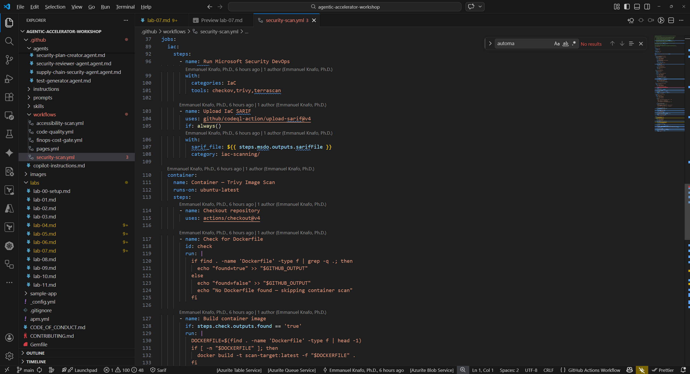
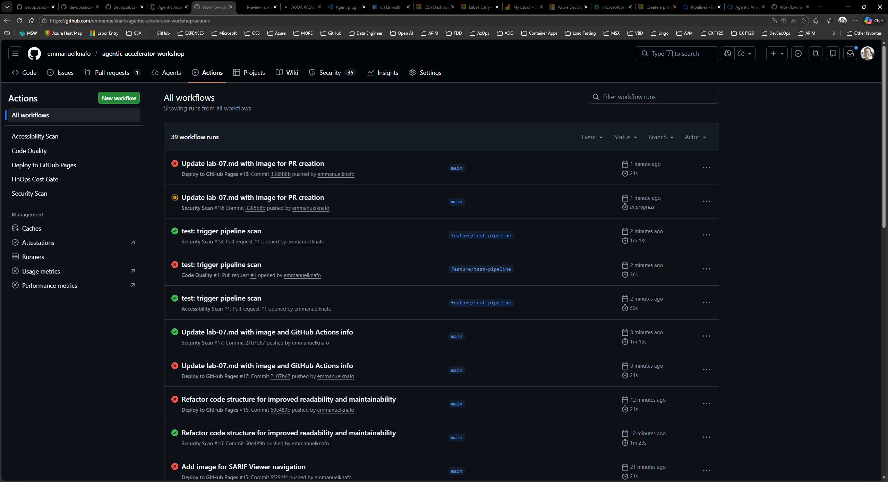
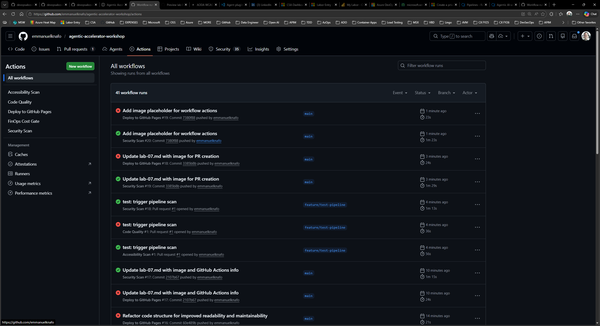

## Aperçu

| | |
|---|---|
| **Durée** | 40 minutes |
| **Niveau** | Intermédiaire |
| **Prérequis** | [Lab 00](lab-00-setup.md) à [Lab 06](lab-06.md) |

## Objectifs d'apprentissage

À la fin de ce lab, vous serez en mesure de :

* Comprendre la structure des workflows GitHub Actions de l'atelier
* Activer GitHub Actions et configurer les permissions des workflows dans votre dépôt
* Créer une branche, effectuer des modifications et ouvrir une pull request pour déclencher les workflows
* Surveiller l'exécution des workflows et consulter les journaux dans l'onglet Actions

## Exercices

### Exercice 7.1 : Examiner les fichiers de workflow

Explorez les quatre fichiers de workflow inclus dans le dépôt pour comprendre le rôle de chacun.

1. Ouvrez `.github/workflows/security-scan.yml` dans VS Code. C'est le workflow le plus complet de l'ensemble.
2. Identifiez les éléments structurels clés :

   | Élément | Valeur | Objectif |
   |---|---|---|
   | `on.push.branches` | `[main]` | Se déclenche lors des pushs vers main |
   | `on.pull_request.branches` | `[main]` | Se déclenche lors des PR ciblant main |
   | `permissions.security-events` | `write` | Permet le téléversement SARIF vers l'onglet Sécurité |
   | `jobs` | Plusieurs jobs | Analyses SCA, SAST, IaC, Container, DAST |

3. Localisez l'étape de téléversement SARIF dans l'un des jobs. Elle utilise `github/codeql-action/upload-sarif@v4` pour envoyer les résultats vers l'onglet Sécurité de GitHub.
4. Passez brièvement en revue les trois workflows restants :

   | Fichier de workflow | Nom | Déclencheur | Catégorie SARIF |
   |---|---|---|---|
   | `accessibility-scan.yml` | Accessibility Scan | PR + planification hebdomadaire | `accessibility-scan/` |
   | `code-quality.yml` | Code Quality | PR uniquement | `code-quality/coverage/` |
   | `finops-cost-gate.yml` | FinOps Cost Gate | PR (modifications de fichiers d'infrastructure) | `finops-finding/` |

5. Notez que les quatre workflows téléversent des fichiers SARIF vers l'onglet Sécurité. Les différentes valeurs de `category` garantissent que les résultats sont regroupés par domaine.



### Exercice 7.2 : Activer GitHub Actions

Confirmez que GitHub Actions est activé et que les permissions sont correctement configurées pour votre dépôt forké.

1. Accédez à votre dépôt sur GitHub.
2. Allez dans **Settings** → **Actions** → **General**.
3. Sous **Actions permissions**, sélectionnez **Allow all actions and reusable workflows**. Cela est nécessaire car les workflows font référence à des actions tierces telles que `anchore/sbom-action` et `github/codeql-action`.
4. Faites défiler jusqu'à **Workflow permissions**.
5. Sélectionnez **Read and write permissions** pour le `GITHUB_TOKEN`. Les workflows ont besoin d'un accès en écriture pour téléverser les fichiers SARIF vers l'onglet Sécurité.
6. Cochez **Allow GitHub Actions to create and approve pull requests** si disponible.
7. Cliquez sur **Save** pour appliquer les modifications.

> [!TIP]
> Si votre organisation applique des politiques plus strictes, vous devrez peut-être demander à un administrateur d'autoriser les actions spécifiques utilisées dans ces workflows.

### Exercice 7.3 : Déclencher les workflows avec une pull request

Créez une branche, effectuez une petite modification et ouvrez une pull request pour déclencher l'exécution des workflows.

1. Ouvrez un terminal dans VS Code et créez une nouvelle branche :

   ```bash
   git checkout -b feature/test-pipeline
   ```

2. Ouvrez `sample-app/src/app/page.tsx` et effectuez une modification visible. Par exemple, ajoutez un commentaire en haut du fichier :

   ```tsx
   // Test change to trigger pipeline workflows
   ```

3. Indexez, committez et poussez la modification :

   ```bash
   git add sample-app/src/app/page.tsx
   git commit -m "test: trigger pipeline scan"
   git push -u origin feature/test-pipeline
   ```

4. Ouvrez votre dépôt dans un navigateur. GitHub devrait afficher une bannière vous suggérant de créer une pull request pour la branche récemment poussée.
5. Cliquez sur **Compare & pull request**.
6. Définissez la branche cible sur `main`, ajoutez un titre descriptif tel que « Test pipeline trigger », puis cliquez sur **Create pull request**.


### Exercice 7.4 : Surveiller l'exécution des workflows

Observez l'exécution des workflows et explorez les journaux d'exécution.

1. Dans votre pull request, faites défiler jusqu'à la section des vérifications. Vous devriez voir les exécutions de workflows commencer à apparaître.
2. Cliquez sur l'onglet **Actions** en haut de la page du dépôt.
3. Localisez les exécutions de workflows déclenchées. Vous devriez voir au moins les workflows Security Scan et Code Quality en cours d'exécution (les workflows Accessibility Scan et FinOps Cost Gate peuvent également se déclencher selon vos modifications).



4. Cliquez sur un workflow en cours d'exécution pour afficher ses détails. Vous verrez chaque job listé avec son état actuel (en file d'attente, en cours ou terminé).
5. Cliquez sur un job spécifique pour développer ses journaux étape par étape. Recherchez :

   * Les étapes de checkout et de configuration se terminant en premier
   * Les outils d'analyse s'exécutant et produisant des résultats
   * Les étapes de téléversement SARIF envoyant les résultats vers l'onglet Sécurité

6. Attendez que tous les workflows soient terminés. Les coches vertes indiquent une exécution réussie. Si un workflow échoue, cliquez dessus pour consulter les journaux d'erreur.



> [!IMPORTANT]
> Ne fusionnez pas et ne fermez pas cette pull request pour l'instant. Le Lab 08 nécessite que les résultats des workflows soient disponibles dans l'onglet Sécurité.

## Point de vérification

Avant de continuer, vérifiez que :

* [ ] Vous avez examiné la structure de `security-scan.yml` et identifié les événements déclencheurs, les jobs et l'étape de téléversement SARIF
* [ ] GitHub Actions est activé avec « Allow all actions » et « Read and write permissions »
* [ ] Vous avez créé une branche, poussé une modification et ouvert une pull request ciblant `main`
* [ ] Au moins deux workflows ont été déclenchés par la pull request
* [ ] Vous pouvez accéder à l'onglet Actions et consulter les journaux des workflows

## Étapes suivantes

Passez au [Lab 08](lab-08.md) pour explorer les résultats SARIF téléversés dans l'onglet Sécurité de GitHub.
