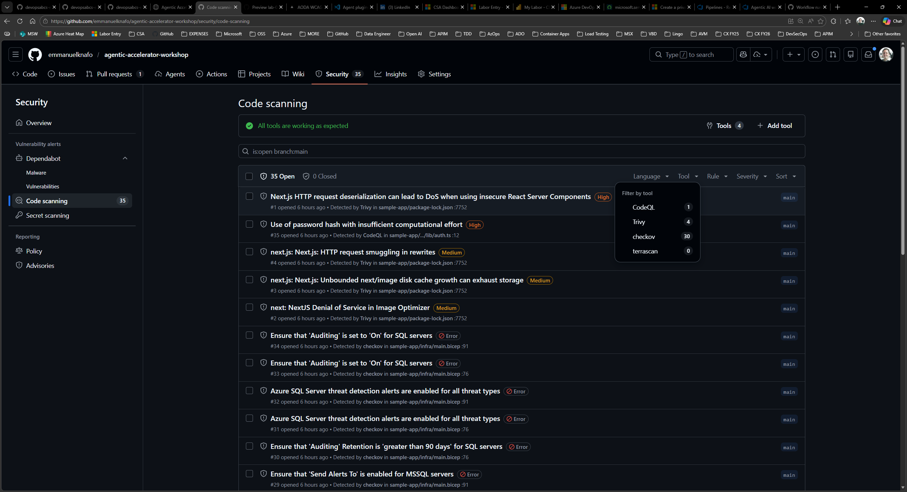

## Aperçu

| | |
|---|---|
| **Durée** | 25 minutes |
| **Niveau** | Intermédiaire |
| **Prérequis** | [Lab 07](lab-07.md) (workflows terminés) |

## Objectifs d'apprentissage

À la fin de ce lab, vous serez en mesure de :

* Naviguer dans l'onglet Sécurité de GitHub et localiser les alertes Code Scanning
* Filtrer les alertes par outil, sévérité et préfixe de catégorie
* Consulter les détails d'un résultat, y compris la description de la règle, la sévérité, le chemin du fichier et l'extrait de code
* Explorer les alertes Dependabot pour les vulnérabilités de dépendances
* Gérer les alertes en rejetant des résultats ou en créant des Issues GitHub

## Exercices

### Exercice 8.1 : Accéder à l'onglet Sécurité

Localisez l'onglet Sécurité où GitHub agrège tous les résultats d'analyse.

1. Ouvrez votre dépôt sur GitHub.
2. Cliquez sur l'onglet **Security** dans la barre de navigation supérieure. Si vous ne le voyez pas, cliquez sur le menu **...** (plus) pour afficher les onglets supplémentaires.
3. Dans la barre latérale gauche, cliquez sur **Code scanning alerts**. Cette page affiche tous les résultats téléversés depuis vos workflows GitHub Actions via SARIF.
4. Passez en revue l'aperçu des alertes. GitHub regroupe les alertes par état (Ouvert, Fermé) et affiche un compteur pour chaque niveau de sévérité.

### Exercice 8.2 : Filtrer et explorer les alertes

Utilisez les contrôles de filtre pour affiner les alertes par outil, sévérité et catégorie.

1. Cliquez sur le menu déroulant **Tool** et sélectionnez l'un des outils d'analyse (par exemple, le scanner de sécurité). La liste se met à jour pour afficher uniquement les alertes de cet outil.
2. Cliquez sur le menu déroulant **Severity** et filtrez par **Error**. Ceux-ci correspondent aux résultats de sévérité CRITICAL et HIGH du framework.
3. Essayez de filtrer par préfixe de catégorie en saisissant un préfixe tel que `security/` ou `code-quality/` dans la barre de recherche. GitHub utilise le champ `automationDetails.id` du fichier SARIF pour prendre en charge ce filtrage.
4. Combinez plusieurs filtres pour vous concentrer sur les résultats les plus pertinents. Par exemple, filtrez par outil et sévérité simultanément pour voir uniquement les alertes de sécurité hautement prioritaires.
5. Notez le nombre total d'alertes pour chaque combinaison de filtres. Cela vous donne une idée de la répartition des résultats par domaine et niveau de sévérité.

### Exercice 8.3 : Consulter les détails d'un résultat

Cliquez sur un résultat individuel pour voir la vue détaillée complète.

1. Cliquez sur n'importe quelle alerte dans la liste pour ouvrir sa page de détails.
2. Examinez les informations affichées :

   | Section | Description |
   |---|---|
   | Description de la règle | Explication de ce que la règle vérifie et pourquoi c'est important |
   | Sévérité | Niveau SARIF correspondant à la sévérité GitHub (Error, Warning, Note) |
   | Chemin du fichier | Fichier exact où le problème a été détecté |
   | Numéro de ligne | Ligne spécifique dans le code source |
   | Extrait de code | Contexte de code mis en évidence autour du résultat |
   | Identifiant de règle | Identifiant unique correspondant au `ruleId` dans le fichier SARIF |

3. Comparez ces informations avec ce que vous avez vu dans l'exercice 6.1 lors de l'examen du fichier SARIF brut. Les champs correspondent directement : `ruleId` à l'identifiant de règle, `level` à la sévérité, `locations[]` au chemin du fichier et au numéro de ligne, `message.text` à la description.
4. Si le résultat fait référence à un CWE ou un critère WCAG, cliquez sur le lien pour consulter la description du standard.

### Exercice 8.4 : Explorer les alertes Dependabot

Examinez les alertes de vulnérabilités de dépendances séparément de l'analyse de code.

1. Retournez à l'onglet **Security**.
2. Dans la barre latérale gauche, cliquez sur **Dependabot alerts**.
3. Dependabot surveille votre `package.json` et d'autres fichiers manifestes pour détecter les vulnérabilités connues dans les dépendances tierces.
4. Si des alertes sont présentes, cliquez sur l'une d'entre elles pour examiner :

   * Le nom et la version du paquet affecté
   * La sévérité de la vulnérabilité et l'identifiant CVE
   * Le correctif recommandé (généralement une mise à jour de version)
   * Si Dependabot peut générer une pull request automatisée pour la corriger

5. Si aucune alerte Dependabot n'apparaît, cela signifie que vos dépendances actuelles ne présentent aucune vulnérabilité connue à ce moment.

> [!TIP]
> Les alertes Dependabot fonctionnent indépendamment des téléversements SARIF. L'analyse de code basée sur SARIF couvre les problèmes d'application et d'infrastructure détectés par les agents, tandis que Dependabot couvre les CVE connus dans les paquets tiers.

### Exercice 8.5 : Gérer les alertes

Pratiquez le cycle de vie des alertes en rejetant un résultat et en créant une issue à partir d'un autre.

1. Retournez à **Code scanning alerts**.
2. Sélectionnez une alerte de faible priorité (sévérité Note) que vous souhaitez rejeter.
3. Cliquez sur **Dismiss alert** et choisissez un motif :

   | Motif | Quand l'utiliser |
   |---|---|
   | **Won't fix** | Le résultat est valide mais ne s'applique pas à votre contexte |
   | **False positive** | Le résultat est incorrect et le code n'est pas vulnérable |
   | **Used in tests** | Le motif signalé n'existe que dans le code de test |

4. L'alerte passe à l'état Fermé. Vous pouvez la rouvrir ultérieurement si nécessaire.
5. Sélectionnez une autre alerte qui mérite un suivi.
6. Cliquez sur **Create issue** (ou utilisez le menu kebab pour trouver cette option). GitHub crée une nouvelle Issue pré-remplie avec les détails du résultat, y compris la règle, le fichier et la description.
7. Consultez l'Issue créée. Elle contient suffisamment de contexte pour qu'un développeur puisse comprendre et remédier au résultat sans retourner à l'onglet Sécurité.

## Point de vérification

Avant de continuer, vérifiez que :

* [ ] Vous avez accédé à l'onglet Sécurité et localisé les alertes Code Scanning
* [ ] Vous avez filtré les alertes par outil, sévérité et préfixe de catégorie
* [ ] Vous avez ouvert la page de détails d'un résultat et identifié la règle, la sévérité, le chemin du fichier et l'extrait de code
* [ ] Vous avez exploré la section des alertes Dependabot
* [ ] Vous avez rejeté au moins une alerte et créé une Issue GitHub à partir d'une autre

## Étapes suivantes

Passez au [Lab 09](lab-09.md) pour explorer la gouvernance FinOps et l'analyse des coûts avec les agents Copilot.
