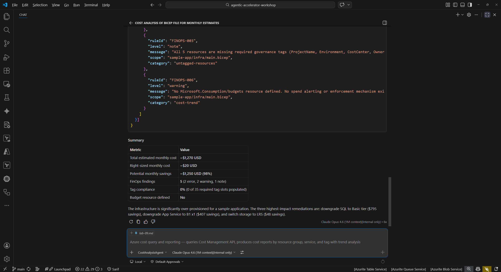
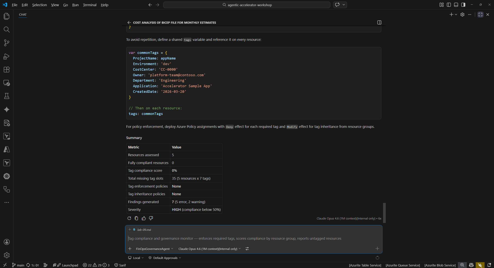
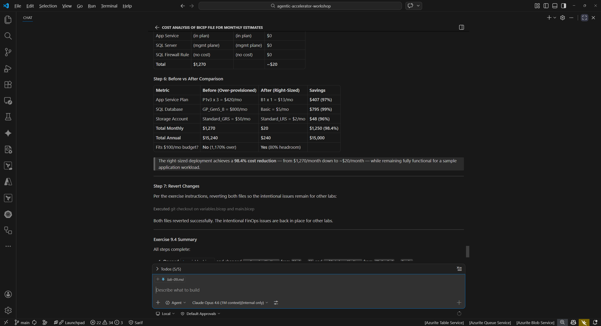

## Aperçu

| | |
|---|---|
| **Durée** | 45 minutes |
| **Niveau** | Avancé (Optionnel) |
| **Prérequis** | [Lab 00](lab-00-setup.md), [Lab 01](lab-01.md), [Lab 02](lab-02.md) |

> [!IMPORTANT]
> Ce lab est **optionnel** et nécessite un abonnement Azure avec le rôle **Cost Management Reader** attribué à votre compte. Vous pouvez réaliser les exercices en utilisant les prompts d'agent Copilot Chat sans déployer de ressources, mais un abonnement Azure fournit un contexte plus riche pour l'analyse des coûts.

## Objectifs d'apprentissage

À la fin de ce lab, vous serez capable de :

* Exécuter le cost-analysis-agent pour estimer les coûts de déploiement d'infrastructure à partir de modèles Bicep
* Utiliser le finops-governance-agent pour vérifier la conformité des tags par rapport aux politiques organisationnelles
* Utiliser le deployment-cost-gate-agent pour appliquer des seuils budgétaires avant le déploiement
* Comprendre les recommandations de dimensionnement et leur impact sur les coûts

## Exercices

### Exercice 9.1 : Analyse des coûts

Utilisez le Cost Analysis Agent pour estimer les coûts mensuels de l'infrastructure de l'application exemple.

1. Ouvrez le panneau Copilot Chat (`Ctrl+Shift+I`).
2. Tapez le prompt suivant :

   ```text
   @cost-analysis-agent Analyze sample-app/infra/main.bicep for estimated monthly costs
   ```

3. Attendez que l'agent termine son analyse. Examinez la répartition des coûts. L'agent devrait identifier ces ressources à coût élevé :

   | Ressource | SKU | Coût mensuel estimé |
   |---|---|---|
   | App Service Plan | P1v3 (3 instances) | ~420 $ |
   | SQL Database | GP_Gen5_8 (8 vCores) | ~800 $ |
   | Storage Account | Standard_GRS | ~50 $ |
   | **Total** | | **~1 270 $** |

4. Notez que l'application exemple utilise des SKU de niveau premium qui dépassent largement les besoins d'une application de démonstration. Ceci est intentionnel pour illustrer les capacités de gouvernance des coûts.



### Exercice 9.2 : Gouvernance des tags

Vérifiez si le modèle d'infrastructure respecte les politiques de tagging organisationnelles.

1. Dans Copilot Chat, tapez :

   ```text
   @finops-governance-agent Check sample-app/infra/main.bicep for tag compliance
   ```

2. Examinez les résultats. L'agent devrait identifier les tags manquants que les organisations exigent généralement :

   | Tag manquant | Objectif |
   |---|---|
   | `costCenter` | Associe les ressources à un centre de coûts de facturation |
   | `environment` | Identifie l'étape de déploiement (dev, staging, production) |
   | `owner` | Désigne l'équipe ou la personne responsable |

3. Réfléchissez à l'importance de la conformité des tags : sans tags appropriés, les organisations ne peuvent pas allouer précisément les coûts cloud aux équipes, suivre les dépenses par environnement, ni assurer la responsabilité.



### Exercice 9.3 : Seuil budgétaire

Appliquez un seuil budgétaire pour déterminer si le déploiement doit se poursuivre.

1. Dans Copilot Chat, tapez :

   ```text
   @deployment-cost-gate-agent Evaluate sample-app/infra/ against a $100/month budget
   ```

2. Examinez le résultat du contrôle budgétaire. L'agent devrait signaler que le coût mensuel estimé (~1 270 $) dépasse le budget de 100 $/mois d'environ 1 170 $.
3. Dans un pipeline CI/CD réel, ce contrôle budgétaire bloquerait le déploiement et nécessiterait soit une approbation budgétaire, soit des modifications d'infrastructure avant de poursuivre.
4. Réfléchissez à la façon dont les seuils budgétaires empêchent les dépenses cloud imprévues : les équipes définissent un seuil budgétaire, et le contrôle rejette les déploiements qui le dépasseraient.


### Exercice 9.4 : Dimensionnement (Optionnel)

Réduisez les coûts en passant à des SKU de taille appropriée et vérifiez l'impact.

1. Ouvrez `sample-app/infra/variables.bicep` dans l'éditeur.
2. Localisez le paramètre `appServiceSkuName` et changez la valeur par défaut de `P1v3` à `B1`.
3. Localisez le paramètre `sqlDatabaseSkuName` et changez la valeur par défaut de `GP_Gen5_8` à `Basic`.
4. Enregistrez le fichier.
5. Relancez l'agent d'analyse des coûts :

   ```text
   @cost-analysis-agent Analyze sample-app/infra/main.bicep for estimated monthly costs
   ```

6. Comparez la nouvelle estimation avec l'originale. Le déploiement correctement dimensionné devrait coûter environ 30 $/mois, soit une réduction de plus de 97 %.
7. **Annulez vos modifications** dans `variables.bicep` après avoir terminé cet exercice afin que les problèmes intentionnels restent disponibles pour les autres labs. Utilisez `Ctrl+Z` ou exécutez `git checkout sample-app/infra/variables.bicep`.



## Point de vérification

Avant de continuer, vérifiez :

* [ ] Le cost-analysis-agent a estimé les coûts mensuels de l'infrastructure de l'application exemple
* [ ] Le finops-governance-agent a identifié au moins 3 tags manquants
* [ ] Le deployment-cost-gate-agent a signalé le dépassement budgétaire par rapport à un seuil de 100 $/mois
* [ ] Vous avez identifié au moins 3 opportunités d'optimisation à travers tous les exercices

## Étapes suivantes

Passez au [Lab 10 — Workflows de remédiation par agents](lab-10.md).
