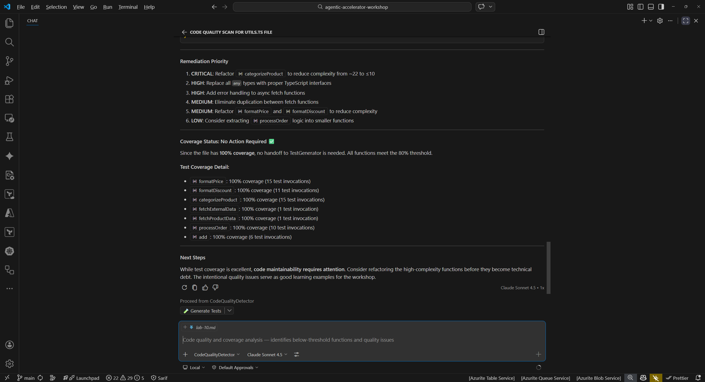

## Aperçu

| | |
|---|---|
| **Durée** | 45 minutes |
| **Niveau** | Avancé |
| **Prérequis** | [Lab 03](lab-03.md), [Lab 04](lab-04.md), ou [Lab 05](lab-05.md) (au moins un lab d'analyse) |

## Objectifs d'apprentissage

À la fin de ce lab, vous serez capable de :

* Réaliser un cycle complet Détection-Correction-Vérification pour les vulnérabilités de sécurité
* Utiliser l'agent de résolution d'accessibilité pour remédier aux problèmes WCAG
* Générer des tests avec le test-generator agent et confirmer l'amélioration de la couverture
* Valider les modifications de remédiation avec des messages de commit descriptifs suivant les conventions du projet

## Exercices

### Exercice 10.1 : Cycle de remédiation de sécurité

Détectez une vulnérabilité cryptographique, appliquez la correction et vérifiez que le problème est résolu.

**Détection :**

1. Ouvrez le panneau Copilot Chat (`Ctrl+Shift+I`).
2. Tapez le prompt suivant pour rechercher des problèmes de sécurité :

   ```text
   @security-reviewer-agent Scan sample-app/src/lib/auth.ts for cryptographic vulnerabilities
   ```

3. L'agent devrait identifier l'utilisation du hachage MD5 (CWE-328: Use of Weak Hash). MD5 est cryptographiquement compromis et inadapté au hachage de mots de passe ou à la vérification d'intégrité.

**Correction :**

4. Demandez à l'agent de remédier au problème :

   ```text
   @security-reviewer-agent Fix the MD5 weak hashing in sample-app/src/lib/auth.ts. Replace with bcrypt or argon2.
   ```

5. Examinez les modifications proposées. L'agent devrait remplacer l'utilisation de MD5 par un algorithme de hachage sécurisé tel que `bcrypt` ou `argon2`.
6. Appliquez les modifications suggérées au fichier.

**Vérification :**

7. Relancez l'analyse de sécurité sur le même fichier :

   ```text
   @security-reviewer-agent Scan sample-app/src/lib/auth.ts for cryptographic vulnerabilities
   ```

8. Confirmez que le problème MD5 (CWE-328) n'apparaît plus dans les résultats.


### Exercice 10.2 : Cycle de remédiation d'accessibilité

Détectez une violation WCAG, appliquez la correction à l'aide de l'agent de résolution et vérifiez le résultat.

**Détection :**

1. Dans Copilot Chat, lancez une analyse d'accessibilité :

   ```text
   @a11y-detector Scan sample-app/src/app/layout.tsx for WCAG 2.2 violations
   ```

2. L'agent devrait identifier que l'élément `<html>` ne possède pas l'attribut `lang`, une violation WCAG 3.1.1 de niveau A. Cet attribut indique aux lecteurs d'écran dans quelle langue le contenu de la page est rédigé.

**Correction :**

3. Utilisez l'agent de résolution d'accessibilité pour appliquer la correction :

   ```text
   @a11y-resolver Fix the missing lang attribute in sample-app/src/app/layout.tsx
   ```

4. Examinez la modification proposée. L'agent devrait ajouter `lang="en"` (ou la locale appropriée) à l'élément `<html>`.
5. Appliquez la modification.

**Vérification :**

6. Relancez l'analyse d'accessibilité :

   ```text
   @a11y-detector Scan sample-app/src/app/layout.tsx for WCAG 2.2 violations
   ```

7. Confirmez que le problème d'attribut `lang` manquant n'apparaît plus.


### Exercice 10.3 : Cycle de remédiation de qualité de code

Détectez une couverture de tests manquante, générez des tests et vérifiez l'amélioration de la couverture.

**Détection :**

1. Lancez une analyse de qualité de code :

   ```text
   @code-quality-detector Scan sample-app/src/lib/utils.ts for code quality issues
   ```

2. L'agent devrait identifier que `utils.ts` n'a pas de fichier de test correspondant. L'absence de couverture de tests est un risque de qualité de code qui rend le refactoring dangereux et les régressions plus difficiles à détecter.

**Correction :**

3. Utilisez le générateur de tests pour créer des tests :

   ```text
   @test-generator Generate unit tests for sample-app/src/lib/utils.ts
   ```

4. Examinez le fichier de test généré. L'agent devrait produire des tests couvrant les fonctions exportées dans `utils.ts`.
5. Appliquez le fichier de test généré à votre projet.

**Vérification :**

6. Exécutez la suite de tests pour confirmer que les nouveaux tests passent et que la couverture s'est améliorée :

   ```text
   @code-quality-detector Check test coverage for sample-app/src/lib/utils.ts
   ```

7. Comparez la couverture avant et après l'ajout des tests. Les nouveaux tests devraient augmenter la couverture de lignes et de branches pour `utils.ts`.




### Exercice 10.4 : Valider vos corrections

Indexez et validez les modifications de remédiation avec un message de commit descriptif.

1. Ouvrez le panneau Contrôle de code source de VS Code (`Ctrl+Shift+G`).
2. Examinez les fichiers modifiés. Vous devriez voir les modifications des exercices ci-dessus :

   * `sample-app/src/lib/auth.ts` (correction de sécurité)
   * `sample-app/src/app/layout.tsx` (correction d'accessibilité)
   * Nouveau(x) fichier(s) de test pour `utils.ts` (correction de qualité de code)

3. Indexez les fichiers que vous souhaitez valider.
4. Rédigez un message de commit descriptif référençant les types de corrections appliquées. Par exemple :

   ```text
   fix: remediate security, a11y, and coverage findings from agent scans
   ```

5. Validez les modifications.
6. Considérez le workflow de pull request : dans un environnement d'équipe, vous pousseriez cette branche et ouvririez une PR pour revue. La description de la PR référencerait les problèmes résolus, facilitant la compréhension de chaque modification par les relecteurs.

> [!TIP]
> Dans un projet réel, vous pourriez séparer ces corrections en commits ou PR distincts regroupés par domaine (corrections de sécurité dans une PR, accessibilité dans une autre). Cela rend les revues plus ciblées et les retours en arrière plus granulaires.

## Point de vérification

Avant de continuer, vérifiez :

* [ ] Vous avez réalisé au moins 1 cycle complet Détection-Correction-Vérification
* [ ] La nouvelle analyse a confirmé que le problème original a été résolu
* [ ] Vous avez validé les modifications de remédiation avec un message descriptif

## Étapes suivantes

Passez au [Lab 11 — Créer votre propre agent personnalisé](lab-11.md).
