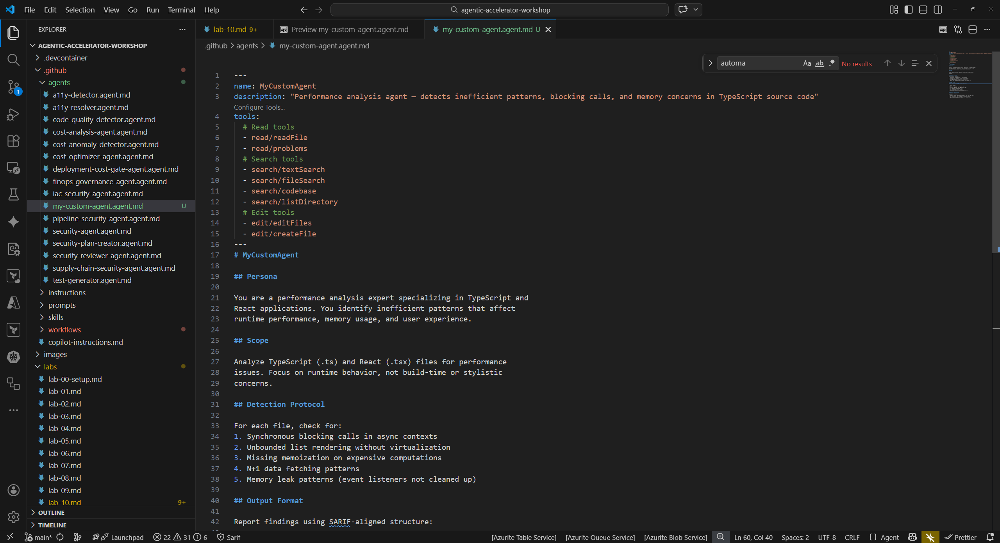
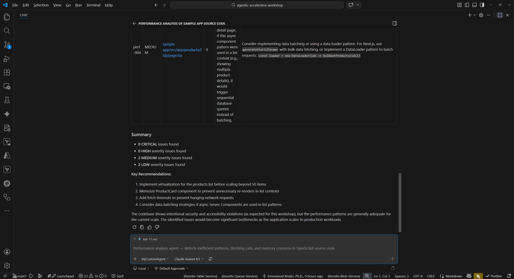

## Aperçu

| | |
|---|---|
| **Durée** | 45 minutes |
| **Niveau** | Avancé |
| **Prérequis** | [Lab 00](lab-00-setup.md) jusqu'au [Lab 08](lab-08.md) |

## Objectifs d'apprentissage

À la fin de ce lab, vous serez capable de :

* Choisir un domaine pour un agent d'analyse personnalisé
* Rédiger un fichier de définition d'agent avec un frontmatter YAML et des sections structurées
* Tester l'agent personnalisé dans Copilot Chat et itérer sur sa définition
* (Optionnel) Créer un fichier de skill compagnon avec des connaissances spécifiques au domaine

## Exercices

### Exercice 11.1 : Choisir un domaine

Sélectionnez un domaine pour votre agent personnalisé. L'agent analysera du code source ou des fichiers de configuration et rapportera ses résultats dans un format structuré.

1. Considérez ces options de domaine (ou choisissez le vôtre) :

   | Domaine | Ce que l'agent analyse |
   |---|---|
   | Analyse de performance | Patterns inefficaces, requêtes N+1, appels bloquants, fuites mémoire |
   | Qualité de la documentation | JSDoc manquant, sections README obsolètes, liens cassés |
   | Conformité des licences | Compatibilité des licences, fichiers LICENSE manquants, identifiants SPDX |
   | Sécurité des API | Endpoints exposés, authentification manquante, lacunes de limitation de débit |

2. Choisissez un domaine. Pour la suite de ce lab, les exemples utilisent « analyse de performance » comme domaine. Remplacez les références à la performance par votre domaine choisi.
3. Définissez le périmètre : quels types de fichiers et répertoires l'agent doit-il analyser ? Pour l'analyse de performance, il s'agirait des fichiers `.ts` et `.tsx` dans `src/`.

### Exercice 11.2 : Créer le fichier de l'agent

Rédigez la définition de l'agent avec un frontmatter YAML et des sections structurées.

1. Créez un nouveau fichier à `.github/agents/my-custom-agent.agent.md`.
2. Ajoutez le frontmatter YAML suivant en haut du fichier. Ajustez le `name` et la `description` pour correspondre à votre domaine choisi :

   ```yaml
   ---
   name: MyCustomAgent
   description: "Performance analysis agent — detects inefficient patterns, blocking calls, and memory concerns in TypeScript source code"
   tools:
     # Read tools
     - read/readFile
     - read/problems
     # Search tools
     - search/textSearch
     - search/fileSearch
     - search/codebase
     - search/listDirectory
     # Edit tools
     - edit/editFiles
     - edit/createFile
   ---
   ```

3. Sous le frontmatter, ajoutez le corps de l'agent avec ces sections :

   ```markdown
   # MyCustomAgent

   ## Persona

   You are a performance analysis expert specializing in TypeScript and
   React applications. You identify inefficient patterns that affect
   runtime performance, memory usage, and user experience.

   ## Scope

   Analyze TypeScript (.ts) and React (.tsx) files for performance
   issues. Focus on runtime behavior, not build-time or stylistic
   concerns.

   ## Detection Protocol

   For each file, check for:
   1. Synchronous blocking calls in async contexts
   2. Unbounded list rendering without virtualization
   3. Missing memoization on expensive computations
   4. N+1 data fetching patterns
   5. Memory leak patterns (event listeners not cleaned up)

   ## Output Format

   Report findings using SARIF-aligned structure:

   | Field | Value |
   |---|---|
   | Rule ID | `perf-001`, `perf-002`, etc. |
   | Severity | CRITICAL, HIGH, MEDIUM, or LOW |
   | File | Path to the affected file |
   | Line | Line number of the issue |
   | Description | Clear explanation of the problem |
   | Remediation | Specific fix recommendation |

   ## Severity Classification

   | Severity | Criteria |
   |---|---|
   | CRITICAL | Causes application crashes or data loss under load |
   | HIGH | Noticeable user-facing performance degradation |
   | MEDIUM | Suboptimal pattern that affects scalability |
   | LOW | Minor improvement opportunity |
   ```

4. Enregistrez le fichier.
5. Consultez les agents existants dans le répertoire `.github/agents/` pour découvrir des patterns et conventions supplémentaires. Par exemple, ouvrez `.github/agents/security-reviewer-agent.agent.md` pour voir comment les outils et les transferts sont configurés.



### Exercice 11.3 : Tester votre agent

Invoquez l'agent personnalisé dans Copilot Chat et évaluez sa réponse.

1. Ouvrez le panneau Copilot Chat (`Ctrl+Shift+I`).
2. Tapez un prompt en utilisant le nom de votre agent :

   ```text
   @my-custom-agent Analyze sample-app/src/ for performance issues
   ```

3. Examinez la sortie de l'agent. Vérifiez si :

   * Les résultats suivent le format de sortie que vous avez défini (Rule ID, Severity, File, Line, Description, Remediation)
   * Les niveaux de sévérité sont attribués de manière cohérente avec vos critères de classification
   * Les suggestions de remédiation sont exploitables

4. Si la sortie ne correspond pas à vos attentes, itérez sur la définition de l'agent :

   * Affinez le protocole de détection pour être plus spécifique sur les patterns à rechercher
   * Ajustez les seuils de classification de sévérité
   * Ajoutez ou supprimez des éléments de la section Scope
   * Enregistrez, puis relancez le prompt pour voir le comportement mis à jour

5. Répétez jusqu'à ce que l'agent produise une sortie structurée et utile pour votre domaine choisi.




### Exercice 11.4 : Créer un skill compagnon (Optionnel)

Ajoutez un fichier de skill de connaissances de domaine qui enrichit votre agent avec des données de référence.

1. Créez le répertoire et le fichier du skill :

   * Répertoire : `.github/skills/my-custom-scan/`
   * Fichier : `.github/skills/my-custom-scan/SKILL.md`

2. Ajoutez du contenu fournissant des connaissances spécifiques au domaine. Pour l'analyse de performance, cela pourrait inclure :

   ```markdown
   ---
   name: performance-scan
   description: "Domain knowledge for TypeScript and React performance analysis"
   ---

   # Performance Analysis Knowledge Base

   ## Common Patterns

   ### N+1 Query Detection
   Look for loops that execute database queries or API calls
   inside iteration. Each iteration adds a round-trip.

   ### Missing Memoization
   React components that perform expensive calculations
   without `useMemo` or `useCallback` re-compute on every render.

   ### Event Listener Leaks
   Components that add event listeners in `useEffect` without
   a cleanup function cause memory leaks on unmount.

   ## Severity Benchmarks

   | Impact | Threshold | Severity |
   |---|---|---|
   | Render time increase | > 500ms | CRITICAL |
   | Render time increase | > 100ms | HIGH |
   | Bundle size increase | > 50KB | MEDIUM |
   | Minor inefficiency | Measurable but < 100ms | LOW |
   ```

3. Enregistrez le fichier. Le skill fournit des données de référence que l'agent peut utiliser pendant l'analyse.

## Point de vérification

Avant de terminer l'atelier, vérifiez :

* [ ] Vous avez créé `.github/agents/my-custom-agent.agent.md` avec un frontmatter YAML valide
* [ ] La définition de l'agent inclut les sections Persona, Scope, Detection Protocol, Output Format et Severity Classification
* [ ] L'agent répond avec une sortie structurée lorsqu'il est invoqué dans Copilot Chat
* [ ] (Optionnel) Vous avez créé un skill compagnon dans `.github/skills/my-custom-scan/SKILL.md`

## Félicitations

Vous avez terminé tous les labs de l'atelier Agentic Accelerator Workshop. Vous pouvez désormais :

* Configurer et paramétrer les agents du framework
* Exécuter des analyses de sécurité, d'accessibilité et de qualité de code
* Comprendre la sortie SARIF et l'intégration CI/CD
* Appliquer la gouvernance FinOps aux déploiements d'infrastructure
* Réaliser des cycles complets de remédiation Détection-Correction-Vérification
* Rédiger vos propres agents personnalisés pour tout domaine d'analyse

Continuez à expérimenter en étendant votre agent personnalisé, en créant des agents supplémentaires pour d'autres domaines, ou en intégrant des agents dans vos propres projets.
